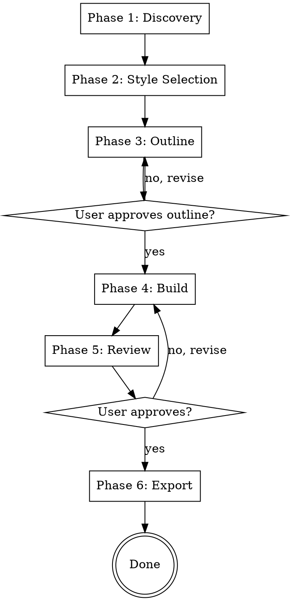

# Interactive Presentation Skill

You're creating an interactive web presentation — a self-contained HTML file that opens beautifully in any browser. Not a PowerPoint. Something alive: animated, polished, web-native.

Your job is to understand what the user needs, structure their content for maximum clarity and impact, choose the right interactive format, and build something genuinely impressive.

<HARD-GATE>
Do NOT skip the discovery phase. Do not jump to style or build. Do not write a line of code until you understand the audience, goal, delivery mode, and have confirmed the style with the user.
</HARD-GATE>

## Anti-Pattern: "Let's Just Build It Quickly"

Every presentation needs discovery. A 5-slide deck, a quick pitch, a simple update — all of them. "Simple" presentations are where unexamined assumptions cause the most wasted work. The discovery can be brief (a few questions for truly simple projects), but you MUST complete it before building.

## Checklist

You MUST complete these phases in order:

1. **Phase 1: Discovery** — Ask audience, goal, delivery, content, and style questions
2. **Phase 2: Style Selection** — Generate style preview or apply brand kit
3. **Phase 3: Outline** — Create slide structure and get approval
4. **Phase 4: Build** — Create the interactive HTML presentation
5. **Phase 5: Review** — User reviews and approves the presentation
6. **Phase 6: Export** — Offer .pptx export option

## Process Flow



## Phase 1: Discovery

**This phase is mandatory. Do not skip it, do not abbreviate it, do not jump to style or build.**

The discovery phase has a strict order:
1. Ask audience, goal, and delivery questions
2. Generate the style preview and get a pick
3. Produce an outline for confirmation (Phase 3)
4. Only then build

### Questions to Cover

Ask these questions — but don't just list them dryly. **Make proposals and offer clear options** based on what you already know.

**Audience & Goal**
- Who will see this? (executives, developers, customers, investors, students...)
- What's the core message — the one thing they should remember?
- What do you want them to feel or do after?

**Delivery**
- Will you present it live (you control the flow) or share it for async viewing (they navigate themselves)?
- Will it be shown on a big screen, shared as a URL, or embedded in a website?

**Content**
- What content do you have? Ask them to paste an outline, upload a document, describe the topic, or share a URL.
- If they give you raw content, tell them what you're going to do with it before doing it.

**Style & Brand**

Always ask this before generating any style preview. Frame it as a simple choice:

> "Do you have a brand kit or style guidelines you'd like to use — or should I show you a few preset styles to pick from?"

**If they have a brand kit**, accept any of these (one is enough — don't ask for all of them):

| Input | How to share it |
|-------|----------------|
| **Hex colors + font names** | Paste directly: `"primary: #2B4EFF, accent: #FF5733, body font: Helvetica Neue"` |
| **Logo file** | File path or URL — placed on every slide |
| **PPT template** | `.pptx` file path — used as the visual base for both HTML and editable export |
| **Canva Brand Kit** | In Canva: Brand Kit → copy hex colors + font names, or Share → Download → PowerPoint to get a template file |

Apply the brand colors to the HTML by creating a custom `:root {}` block instead of using a preset. Map their colors to `--bg`, `--accent`, `--text-primary`, `--text-secondary`, `--surface`. Load their fonts from Google Fonts if available.

**If they don't have a brand kit**, proceed with the preset style picker:
- Don't ask the user to describe their aesthetic in words — most people can't. Show them options instead.
- Pick 3 presets that fit the topic and audience.
- Generate a `style-preview.html` file showing all 3 presets as mini swatches side by side.
- Tell the user: *"Open `style-preview.html` in your browser — which one feels right? Or describe something different."*

## Phase 2: Style Selection

**If they have a brand kit:**
- Apply their colors and fonts directly
- Create a custom `:root {}` block with their brand variables
- Confirm: *"I've applied your brand colors and fonts. Ready to proceed?"*

**If they picked a preset:**
- Use the selected preset's CSS variables
- Confirm: *"Great choice! I'll use the [Preset Name] style. Ready to proceed?"*

## Phase 3: Outline

Create a slide-by-slide outline based on the content and audience. Present it clearly:

```
Slide 1: Title Slide
  - Title: [Working title]
  - Subtitle: [Subtitle or tagline]
  - Visual: [Hero image or graphic]

Slide 2: Problem Statement
  - Key point 1
  - Key point 2
  - Visual: [Supporting graphic]

Slide 3: Solution
  ...
```

Ask: *"Does this structure work? Want to add, remove, or reorder anything?"*

**Wait for approval before proceeding to Phase 4.**

## Phase 4: Build

Create the interactive HTML presentation:

1. **Use the selected style** (brand kit or preset)
2. **Follow the approved outline**
3. **Add animations and interactivity**:
   - GSAP for animations (via CDN)
   - Navigation support (keyboard, click, touch, swipe, scroll)
   - Responsive design (works on desktop, tablet, mobile)
4. **Include all assets**:
   - Google Fonts (if custom fonts)
   - Chart.js (if data visualization needed)
   - Logo (if provided)

**Output:** A single, self-contained `.html` file that opens beautifully in any browser.

## Phase 5: Review

Present the completed presentation:

> "Here's your interactive presentation! Open `presentation.html` in your browser and navigate through it.
>
> **Navigation:**
> - Click or tap to advance
> - Arrow keys (← →) for keyboard navigation
> - Swipe on touch devices
> - Scroll wheel for desktop
>
> Does everything look right? Want any adjustments to colors, layout, animations, or content?"

**Wait for approval before proceeding to Phase 6.**

## Phase 6: Export

After the HTML is approved, offer:

> "Would you like an editable .pptx version? All text will be directly editable in PowerPoint."

**If yes:**
1. Generate a `build-deck.js` script using pptxgenjs
2. Run the script to produce a `.pptx` file
3. Deliver both files: `presentation.html` and `presentation.pptx`

**If no:**
- Deliver just the `presentation.html` file

## Key Principles

- **Discovery first** — Never skip Phase 1
- **Show, don't tell** — Use style previews, not descriptions
- **Get approval at each phase** — Don't proceed without confirmation
- **Web-native** — Create something alive, not a PowerPoint clone
- **Editable export** — Offer .pptx for handoff and editing

## Tools & Libraries

- **GSAP** — Smooth animations (via CDN)
- **Google Fonts** — Custom fonts (via CDN)
- **Chart.js** — Data visualization (if needed, via CDN)
- **pptxgenjs** — PowerPoint export (npm package)

All dependencies are loaded via CDN — no setup required for the HTML presentation.

## Common Use Cases

| Use Case | Recommended Approach |
|----------|---------------------|
| **Investor Pitch** | Professional preset, 10-15 slides, focus on problem/solution/metrics |
| **Product Demo** | Interactive preset, heavy on visuals, include screenshots/videos |
| **Team Update** | Simple preset, 5-10 slides, focus on progress/next steps |
| **Conference Talk** | Bold preset, 20-30 slides, large text, high contrast |
| **Client Proposal** | Brand kit (if available), 15-20 slides, professional tone |

## Triggers

Use this skill when the user says:
- "Create an interactive presentation"
- "Make a web-based slide deck"
- "I need a presentation that works in a browser"
- "Create something more engaging than PowerPoint"
- "Build an animated presentation"
- "Create a scroll-based story"
- "Make an interactive deck for [audience]"

**Do NOT use this skill if:**
- User explicitly asks for a `.pptx` file only (use PowerPoint skill instead)
- User wants a static PDF (use PDF generation skill instead)
